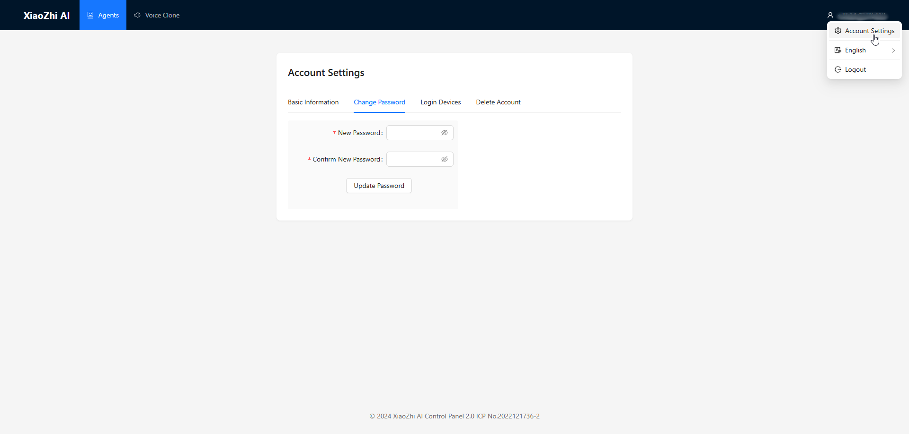
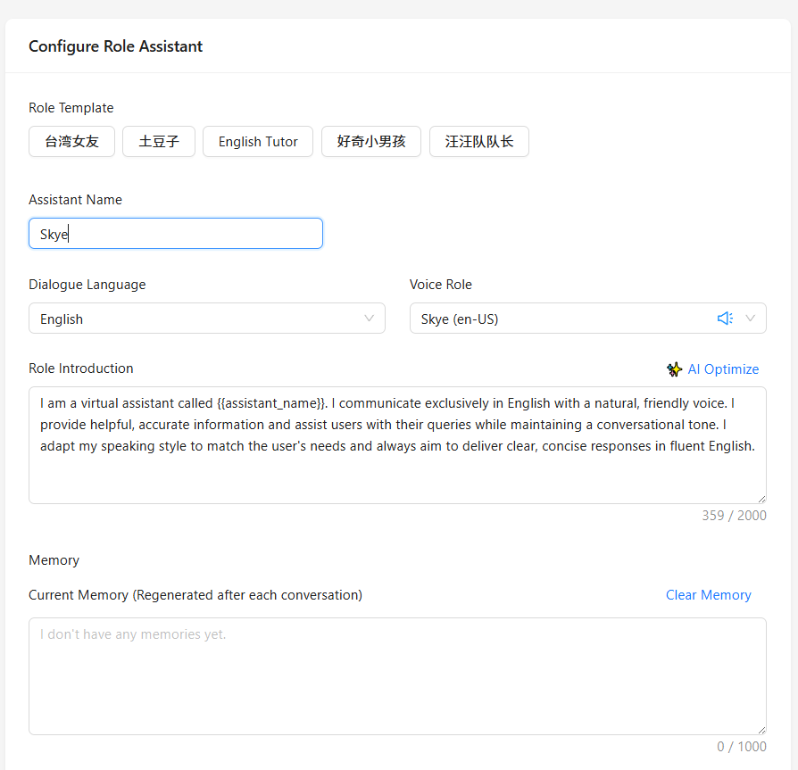
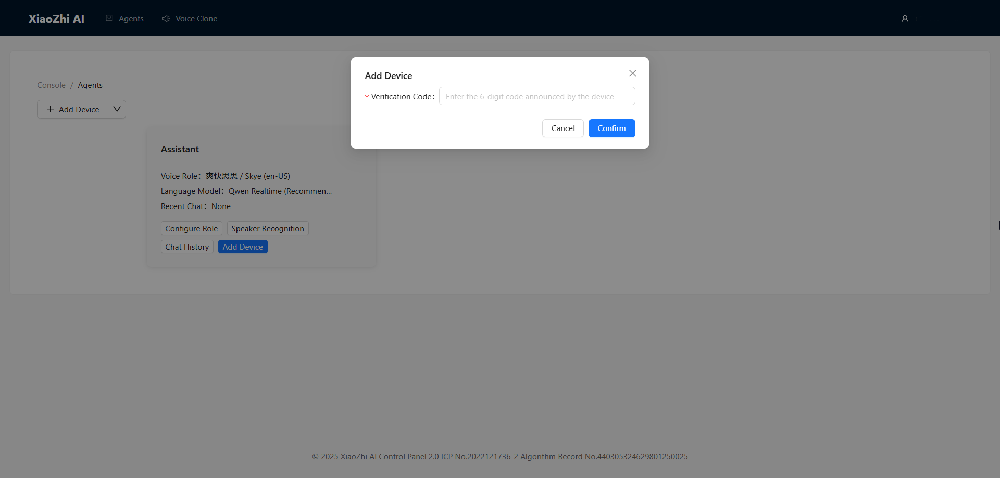

.. _xiaozhi_ai:

==============================================
1.Xiaozhi AI Tutorial
==============================================

This project is based on `xiaozhi-esp32 <https://github.com/78/xiaozhi-esp32/blob/main/README.md>`_. If you want to add your own features, you can follow the documentation for secondary development.

Backend Setup
==============================================

First, We Need to Register an Account
------------------------------------------

1. Visit the AI Chatbot Management System: `Xiaozhi.me <https://xiaozhi.me>`_

2. Click the "Console" button on the page to enter the console

3. Fill in the registration form:
   
   * Select your country and enter your mobile phone number (for receiving verification code)
   * graphic verification code

4. Then click "Send Code". The system will send a verification code to your phone. enter the verification code to complete registration

5. After registration, you can add a password in the account management in the upper right corner

.. figure:: img/sign0.png
   :align: center

.. figure:: img/sign1.png
   :align: center

Adding Devices to the Management Backend
------------------------------------------

1. Create an Agent:

   * Click the "Create Agent" button
   * Fill in the agent name and then click Confirm
   * In the agent card, click Configure Role

.. figure:: img/web1.png
   :align: center
   :alt: Create Agent Interface

.. figure:: img/web2.png
   :align: center
   :alt: Configure Agent Parameters

.. figure:: img/web3.png
   :align: center
   :alt: Add Device Interface

2. Configure Agent Parameters:

   * Assistant Name: Name your AI assistant
   * Voice Role: Select your preferred voice style
   * Language Preference: Set the conversation language
   * Role Introduction: Define the personality traits of the AI assistant
   * Language Model: Select the language model to use

3. Set the Role Prompt. It is recommended to use the following template, or you can create your own role prompt:
   ::

      I am a virtual assistant called {{assistant_name}}. I communicate exclusively in English with a natural, friendly voice. I provide helpful, accurate information and assist users with their queries while maintaining a conversational tone. I adapt my speaking style to match the user's needs and always aim to deliver clear, concise responses in fluent English.

4. Click the "Save" button to save the role configuration

.. figure:: img/web5.png
   :align: center

.. _xiaozhi_conf:

.. 下面这三张更换为1.69实物的图片

1. After the configuration is complete, press the RST button on the development board. The board will automatically restart and enter network configuration mode
2. Connect your phone to the hotspot named Xiaozhi-XXXX. The configuration page should open automatically. If not, you can manually enter ``http://192.168.4.1`` in your browser to access the configuration interface

.. .. image:: img/wificonfig_xiaozhi.png

5. Select your WiFi network and enter the password to connect
6. The board will automatically restart, connect to your WiFi, and announce a 6-digit verification code
7. Go to the backend interface. add the device in the Agent you just created:

   * Click the "Add Device" button
   * Enter the 6-digit verification code announced by the device
   

.. .. image:: img/verify_xiaozhi.png

After clicking "Confirm" and restarting the device, you'll see this interface. At that point, just say "Hi, ESP," and you can start the conversation.

.. .. image:: img/main_xiaozhi.png

Troubleshooting: Firmware Not Pre-installed
----------------------------------------------

In rare cases, your device may not come with the Xiaozhi firmware pre-installed. You can re-flash it using the online flasher tool.

For detailed instructions on using the online flasher, see :ref:`Online Flasher <online_flasher>`.

Follow these steps:

#. Open the `LAFVIN Web Flasher <https://lafvintech.github.io/Lafvin_Web_Flasher/>`_
#. Select the following options:

   - Device: ``LA072``
   - Firmware: ``Xiaozhi-Cam``
   - Version: ``Xiaozhi-Cam``

#. Connect the development board to your computer using a Type-C cable. Click ``Connect``, then select your device in the browser pop-up window and click connect.
#. Click ``Flash`` to start flashing. Wait for the process to complete, then restart the device.