.. _arduino_tutorial:

2. Arduino
================

.. tip::
  All projects in this chapter have pre-compiled firmware available on the :ref:`Online Flasher <online_flasher>`. If you prefer not to wait for compilation, you can flash our pre-built binaries directly.

First, in this section, we need to download the Arduino IDE. You can follow the steps in the section below to install it.

:ref:`Install Arduino IDE <install_arduino_ide>`

After installing Arduino IDE and configuring the ESP32 board package according to this tutorial, we can install the libraries required for this project.

.. attention:: 
  The device requires a stable power supply. We recommend using an adapter rated at least 5V/2A or a standard USB 3.0 port; otherwise, the program may crash unexpectedly. You can also use a 3.7V lithium battery with an SH1.0-2P connector for power.

Installing Project Libraries
-----------------------------

You can install the libraries in Arduino by yourself. We also provide related offline zip files. After downloading the code, you can find these two library files in the libraries folder.

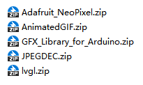

You need to open Arduino ‣ Sketch ‣ Include library ‣ Add .zip Library.

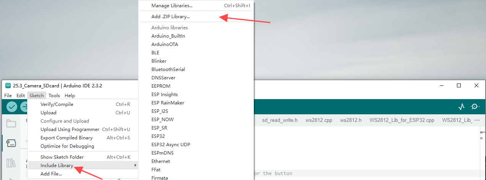

Then in the pop-up window, select each of our offline library files one by one and click install. You may need to perform this process few times to install all the libraries. After that, you can start compiling our project.

Compile Arduino Project
-----------------------

Let's take the 01_HelloWorld project as an example. Double-click to open 01_HelloWorld.ino. The system will automatically open Arduino IDE. Then, set the port and board type as shown in the images below.

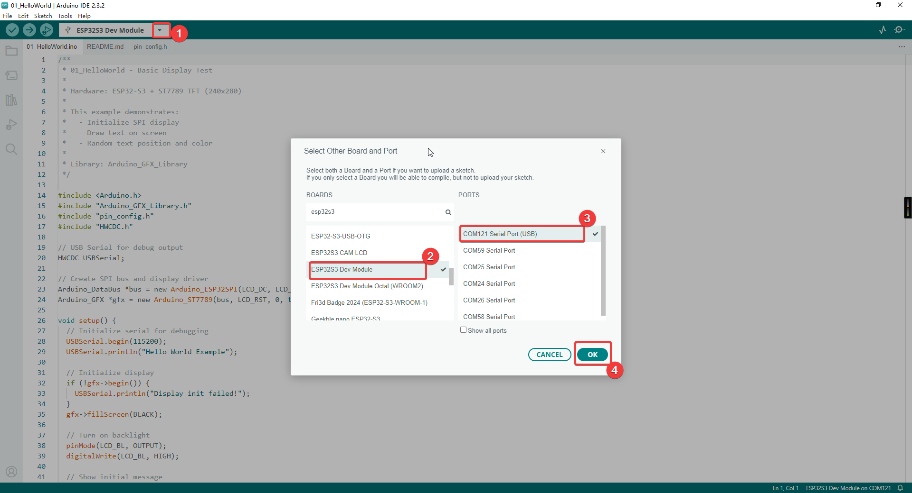

.. note:: 
   Make sure the development board is connected to the correct port. You can find the port number in Device Manager.

We also need to adjust the Flash Size to 16MB and partition table: Click Tools in the upper-left corner > Select Partition Scheme > Choose "16M Flash (3MB APP/9.9MB FATFS)".

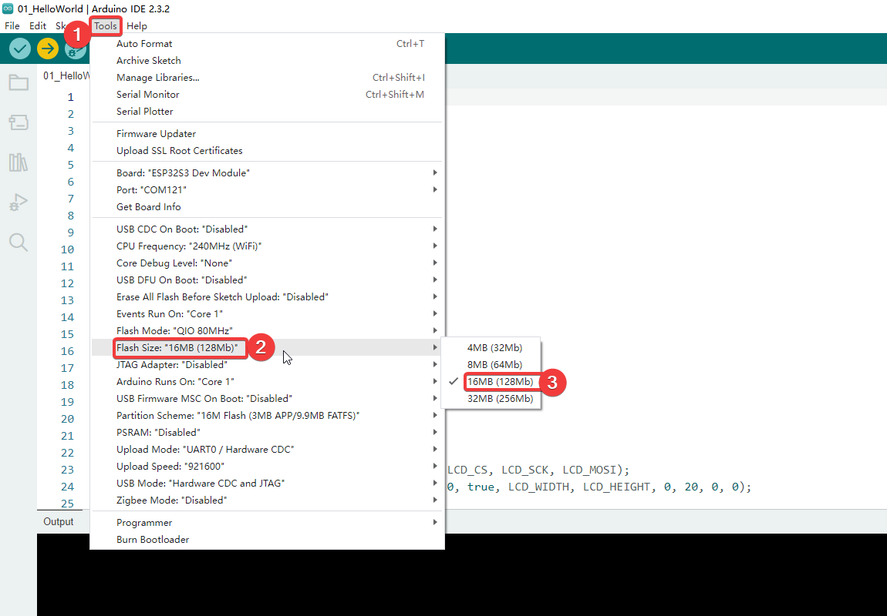

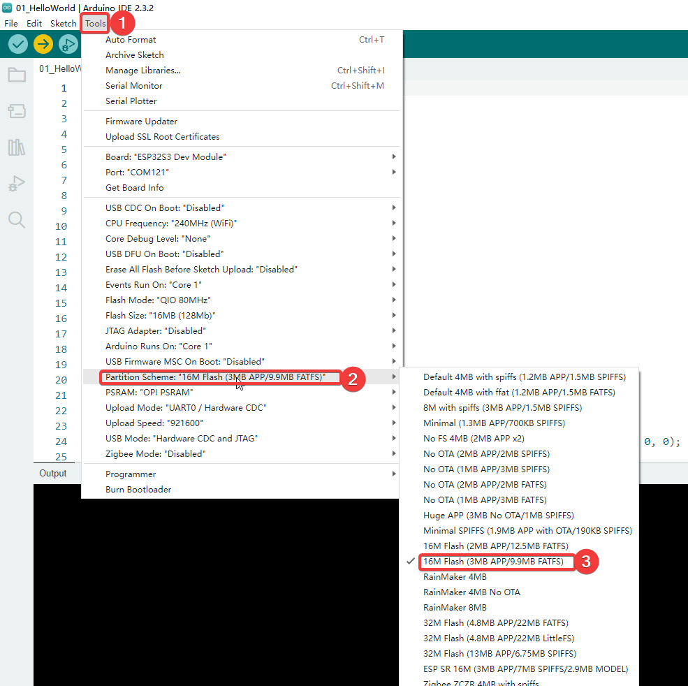

After configuration, click the right arrow button in the upper left corner to start compiling and uploading.

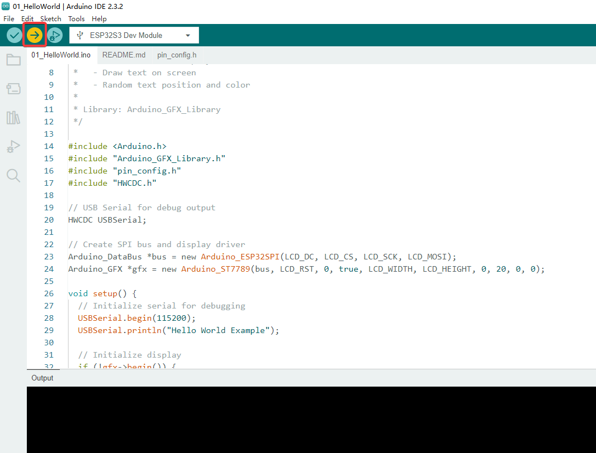

.. attention::  
   Some programs use LVGL, which may take a long time, so please be patient

01_HelloWorld
----------------

Based on the Arduino_GFX_Library HelloWorld example, adapted for an ESP32‑S3 board with an ST7789 TFT display. The sketch repeatedly renders “Hello World” text on the screen to verify the display driver, SPI wiring, and basic drawing performance.

#. Initialize the SPI display
#. Show "Hello World!" in red
#. Every second, display "Hello World!" at random position with random color and size

Hardware Connection
^^^^^^^^^^^^^^^^^^^^
Use Type-C Cable connect the board to your computer.

Code Analysis
^^^^^^^^^^^^^^

.. code-block:: text

   setup()
     ├── Init USB Serial (for debug)
     ├── Init ST7789 display via SPI
     ├── Turn on backlight
     └── Show initial "Hello World!"

   loop()
     ├── Set random cursor position
     ├── Set random text color
     ├── Set random text size
     └── Print "Hello World!"

Run Result
^^^^^^^^^^^^^^

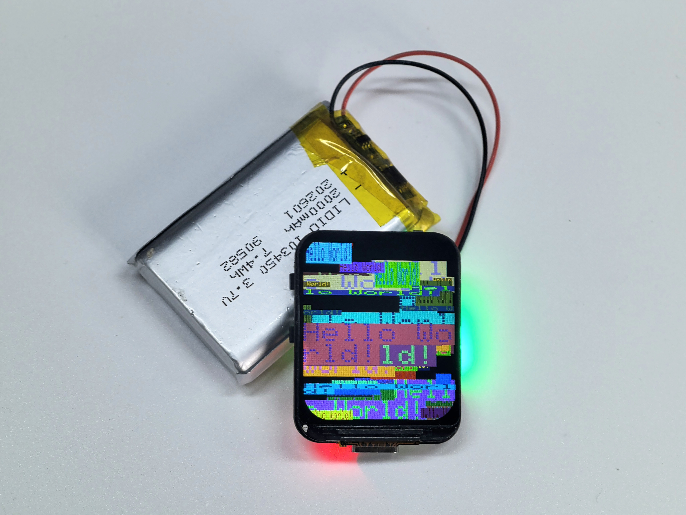

02_Matrix
----------------

A “hacker/Matrix” style code‑rain animation built with Arduino_GFX_Library. ASCII characters continuously fall from the top of the screen with random columns and speeds, creating a classic green terminal rain visual effect.
Creates the iconic "Matrix" digital rain animation with:

- Multiple columns of falling characters
- White head with green fading trail
- Random character flickering
- Variable fall speeds

Hardware Connection
^^^^^^^^^^^^^^^^^^^^

Use Type-C Cable connect the board to your computer.

Code Analysis
^^^^^^^^^^^^^^

.. code-block:: text

   setup()
     ├── Init display
     ├── Initialize column arrays:
     │   ├── heads[] - vertical position of each column
     │   ├── speeds[] - fall speed (1-2)
     │   └── chars[][] - random ASCII characters

   loop()
     ├── For each column:
     │   ├── Draw trail (head + fading tail)
     │   ├── Erase old tail end
     │   ├── Move head down
     │   └── Reset to top if off screen
     └── Delay 50ms

Run Result
^^^^^^^^^^^^^^

 .. image:: img/arduino/02.jpg

03_SimpleWatch
----------------

A simple digital clock implemented with Arduino_GFX_Library. It connects to Wi‑Fi, synchronizes time via NTP, and displays the current time on the screen with automatic periodic re-sync for better accuracy.

#. Connect to WiFi network
#. Sync time from NTP server
#. Display digital clock with date and weekday

Hardware Connection
^^^^^^^^^^^^^^^^^^^^

Use Type-C Cable connect the board to your computer.

Setup
^^^^^^^^^^^^^^

Edit ``pin_config.h`` before uploading:

.. code-block:: cpp

   #define WIFI_SSID     "YOUR_WIFI_SSID"
   #define WIFI_PASSWORD "YOUR_WIFI_PASSWORD"
   #define GMT_OFFSET    28800   // Your timezone in seconds

Code Analysis
^^^^^^^^^^^^^^

.. code-block:: text

   setup()
     ├── Init display
     ├── Connect to WiFi
     │   └── Show "Connecting WiFi..."
     ├── Configure NTP server
     ├── Wait for time sync
     └── Draw watch face

   loop()
     ├── Get current time
     ├── If second changed:
     │   └── updateDisplay()
     │       ├── Draw HH:MM (large)
     │       ├── Draw SS (small)
     │       ├── Draw YYYY-MM-DD
     │       └── Draw weekday
     └── Delay 100ms

Run Result
^^^^^^^^^^^^^^

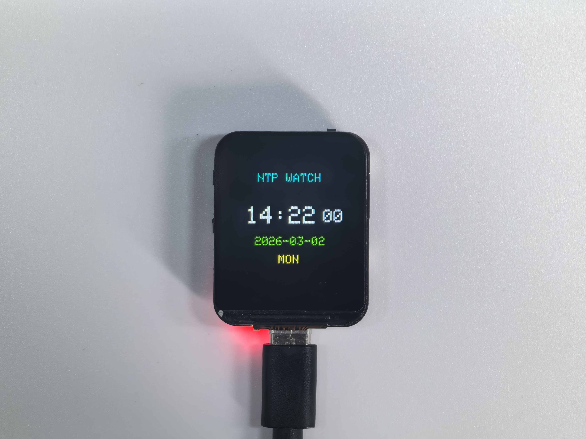

04_GFX_WIFIAnalyzer
----------------------

04_GFX_WIFIAnalyzer is a signal analysis tool designed for the ESP32-S3 with a 240×280 ST7789 display, powered by the Arduino_GFX_Library. It scans Wi-Fi channels 1–14 every 2000ms, visualizing signal distribution through intuitive RSSI-based arc heights.

#. Scan nearby WiFi networks every 2 seconds
#. Display signal strength as arcs on a channel graph
#. Show SSID and RSSI for strongest network on each channel
#. Color-coded by channel number

Hardware Connection
^^^^^^^^^^^^^^^^^^^^

Use Type-C Cable connect the board to your computer.

Code Analysis
^^^^^^^^^^^^^^

.. code-block:: text

   setup()
     ├── Init display
     ├── Calculate layout parameters
     ├── Draw title
     └── Set WiFi to scan mode

   loop()
     ├── Scan WiFi networks
     ├── Clear graph area
     ├── First pass: find strongest signal per channel
     ├── Second pass: draw signal arcs
     │   ├── Map RSSI to arc height
     │   ├── Draw arc with channel color
     │   └── Show SSID for peak signal
     ├── Draw X-axis with channel labels
     └── Wait 2 seconds

Parameters
^^^^^^^^^^^^^^

.. list-table::
   :widths: 30 20 50
   :header-rows: 1

   * - Name
     - Value
     - Description
   * - RSSI_CEILING
     - -40
     - Strongest signal (dBm)
   * - RSSI_FLOOR
     - -100
     - Weakest signal (dBm)
   * - SCAN_INTERVAL
     - 2000
     - Scan interval (ms)

Run Result
^^^^^^^^^^^^^^

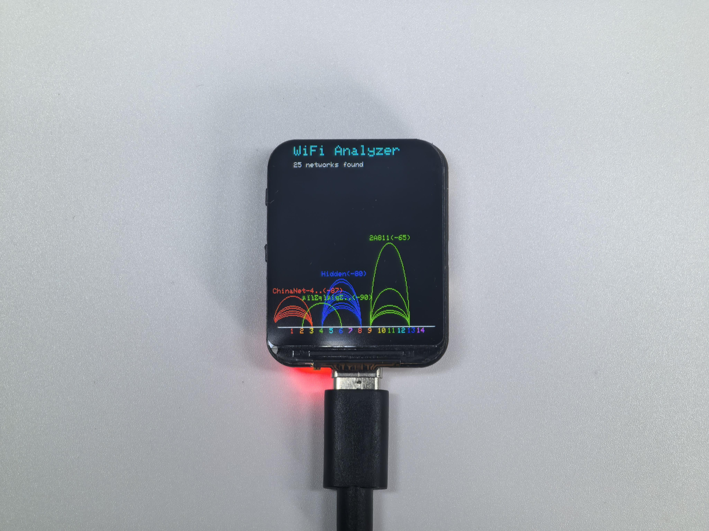

05_GIF_Player
----------------

Animated GIF player with WiFi upload capability.

#. Create WiFi hotspot (AP mode)
#. Serve web page for GIF upload
#. Save uploaded GIF to flash storage (FFat)
#. Decode and play GIF animation in loop

Hardware Connection
^^^^^^^^^^^^^^^^^^^^

Use Type-C Cable connect the board to your computer.

Usage
^^^^^^^^^^^^^^

#. Upload sketch to ESP32-S3
#. Connect phone to WiFi: ``GIF_Player`` (password: ``12345678``)
#. Open browser: ``192.168.4.1``
#. Upload a GIF file
#. GIF plays automatically

Code Analysis
^^^^^^^^^^^^^^

.. code-block:: text

   setup()
     ├── Init display
     ├── Init FFat filesystem
     ├── Create WiFi AP hotspot
     ├── Start web server
     ├── Init GIF decoder
     └── Show waiting screen (if no GIF)

   loop()
     ├── Handle web requests
     ├── If uploading: skip playback
     └── If hasGif:
         ├── Open GIF file
         ├── Play frames in loop
         │   └── Handle web requests between frames
         └── Close GIF

Run Result
^^^^^^^^^^^^^^

.. video:: img/arduino/05.mp4
   :width: 600
   :height: 450
   :align: center

06_LVGL_Time
----------------

A modern watch‑style UI built with the LVGL graphics library. It connects to Wi‑Fi, synchronizes time using NTP, and displays a sleek watch face (time/date/weekday) with a clean, modern visual style.

#. Connect to WiFi and sync time from NTP server
#. Display digital clock with animated seconds arc
#. Show date and weekday
#. Modern dark theme UI

Hardware Connection
^^^^^^^^^^^^^^^^^^^^

06_LVGL_Time is a sophisticated digital clock implementation designed for the ESP32-S3 paired with a 240×280 ST7789 display. Leveraging the powerful LVGL (v8.x) graphics library and the Arduino_GFX_Library, this demo showcases a sleek, "dark-mode" watch face with high-performance rendering.

Setup
^^^^^^^^^^^^^^

Edit ``pin_config.h`` before uploading:

.. code-block:: cpp

   #define WIFI_SSID     "YOUR_WIFI_SSID"
   #define WIFI_PASSWORD "YOUR_WIFI_PASSWORD"
   #define GMT_OFFSET    28800   // Your timezone in seconds

Code Analysis
^^^^^^^^^^^^^^

.. code-block:: text

   setup()
     ├── Init display
     ├── Init LVGL
     │   ├── Create display buffer
     │   └── Register display driver
     ├── createWatchFace()
     │   ├── Create outer arc (decoration)
     │   ├── Create seconds arc (animated)
     │   ├── Create time label
     │   ├── Create date label
     │   ├── Create weekday label
     │   └── Create status label
     ├── Connect WiFi
     ├── Sync NTP time
     └── Create update timer (500ms)

   loop()
     └── lv_timer_handler()
         └── updateTimeCallback()
             └── updateTimeDisplay()

LVGL Components Used:

- ``lv_arc`` - Circular progress indicator
- ``lv_label`` - Text display
- ``lv_timer`` - Periodic callback

Run Result
^^^^^^^^^^^^^^

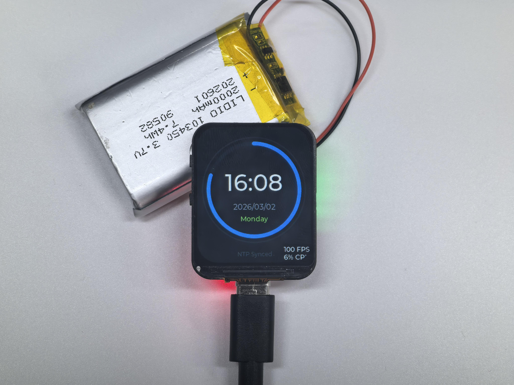

07_LVGL_LED
----------------

07_LVGL_LED is a sophisticated integration demo for the ESP32-S3, combining physical hardware control with a modern LVGL (v8.x) graphical interface. It allows users to manage a WS2812 RGB LED using a single hardware button (GPIO0) while receiving real-time visual feedback on a 240x280 ST7789 display.

- Single click Boot button to change LED to random color
- Double click Boot button to toggle LED on/off
- LVGL UI displays current LED status and hex color value
- Visual LED indicator with glow effect

Hardware Connection
^^^^^^^^^^^^^^^^^^^^

Use Type-C Cable connect the board to your computer.

Code Analysis
^^^^^^^^^^^^^^

#. **Setup**: Initialize display, LVGL, WS2812 LED, and button
#. **Create UI**: Build dark-themed interface with circular LED indicator, status label, and color value
#. **Main Loop**: 

   - Poll button state with debounce logic
   - Detect single vs double click (300ms timeout)
   - Update LED hardware and UI on state change
   - Run LVGL timer handler

Run Result
^^^^^^^^^^^^^^

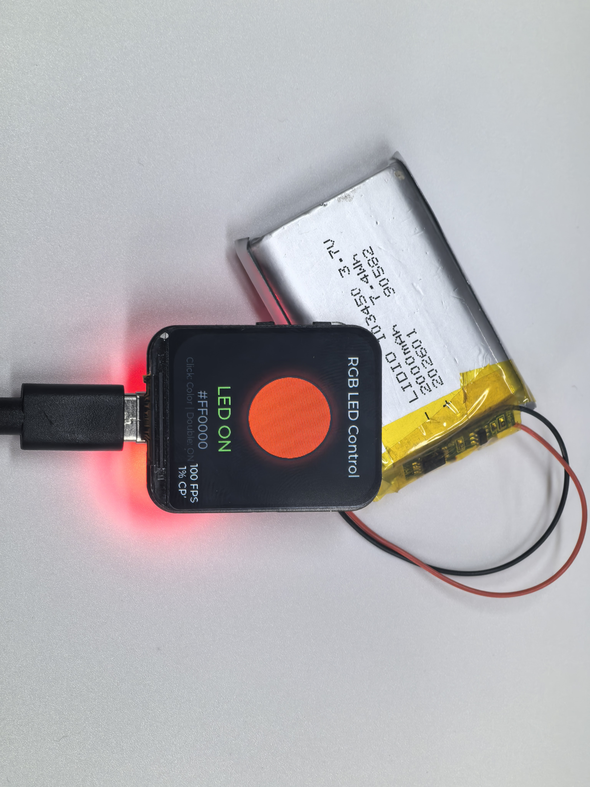

08_WiFi_ImageViewer
---------------------

08_WiFi_ImageViewer is a versatile image hosting and display demo for the ESP32-S3. It transforms the device into a standalone wireless photo frame that allows users to upload and view images via a localized web portal.

- Creates WiFi AP hotspot (Image_Viewer)
- Web interface for image upload
- Client-side image resize to fit 240x280 screen
- JPEG decode and centered display
- New uploads replace previous image

What makes this version unique (vs. 05_GIF_Player):
^^^^^^^^^^^^^^^^^^^^^^^^^^^^^^^^^^^^^^^^^^^^^^^^^^^^^^^^^^^^

Unlike the GIF Player, this project features intelligent client-side preprocessing. When you select an image (JPG/PNG) on your phone or PC, the hosted web page uses HTML5 Canvas to automatically resize and crop the image to exactly 240×280 before the upload begins. This clever optimization minimizes WiFi transmission time, saves storage space in the FFat filesystem, and ensures the JPEGDEC library can render the image perfectly without exceeding memory limits.

Hardware Connection
^^^^^^^^^^^^^^^^^^^^

Use Type-C Cable connect the board to your computer.

Usage
^^^^^^^^^^^^^^

#. Connect to WiFi: ``Image_Viewer`` (password: ``12345678``)
#. Open browser: ``192.168.4.1``
#. Select image file (JPG, PNG supported)
#. Image auto-resizes and uploads

Code Analysis
^^^^^^^^^^^^^^

#. **Setup**: Initialize display, FFat filesystem, WiFi AP, and web server
#. **Show Instructions**: Display WiFi name, password, and IP address
#. **Web Server**: 

   - Serve upload page with JavaScript image processing
   - Browser resizes image before upload (maintains aspect ratio)
   - Save uploaded JPEG to FFat filesystem

#. **Display**: Decode JPEG and center on screen

Run Result
^^^^^^^^^^^^^^

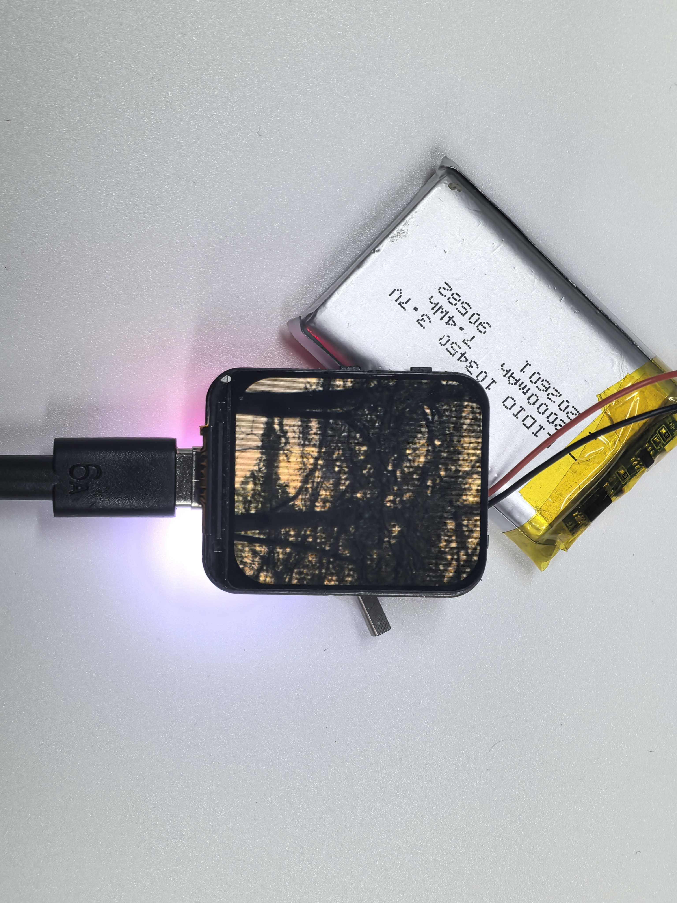

