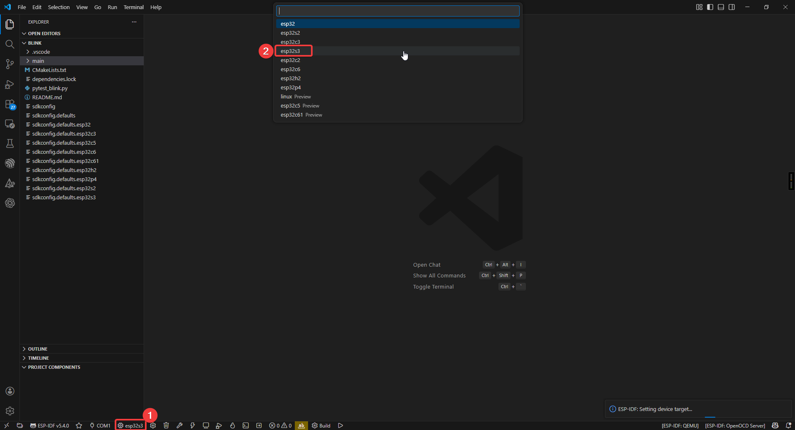
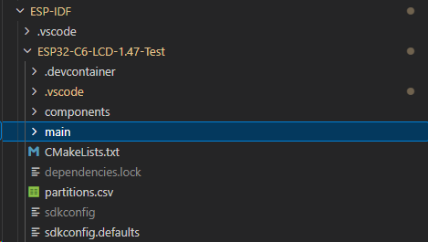
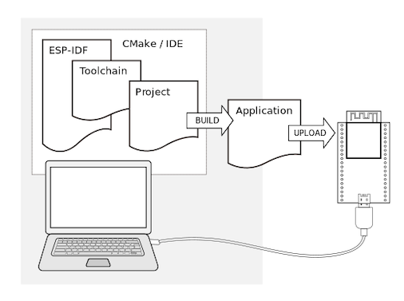
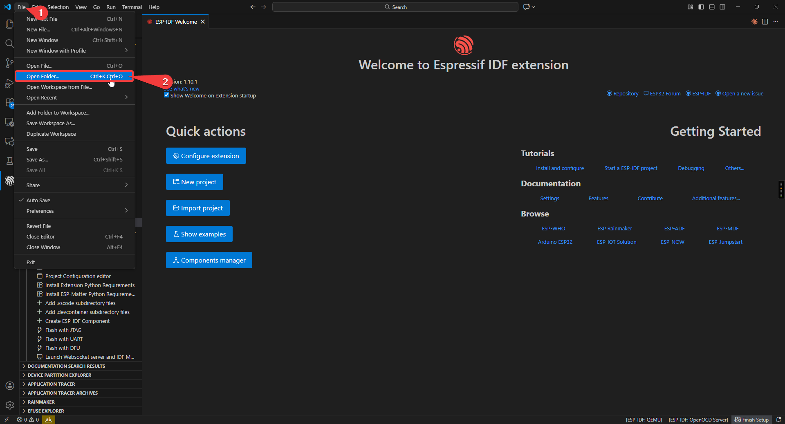
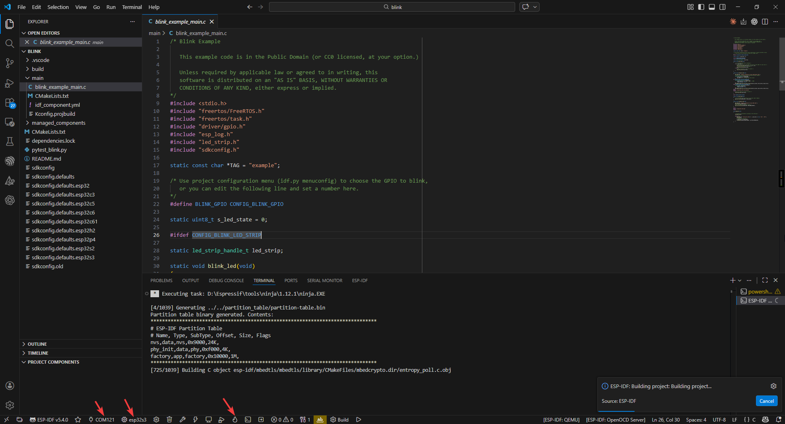

3. ESP-IDF
=================

First, in this section, we need to configure the IDF development environment. You can follow the chapters below for installation.

:ref:`Install ESP-IDF <idf_install>`

After installing VSCode and IDF as per the tutorial, We're ready to start configuring the project.

Project Configuration
-----------------------------------
First, you need to configure the COM port, Flash Method and chip model (using esp32s3 as an example).

.. image:: img/idf_conf1.png

.. image:: img/idf_conf3.png

.. image:: img/idf_conf6.png

Project Structure
-----------------

1. Project-level configuration (root directory):
    CMakeLists.txt: The core configuration file for project building.
     • Specifies the target chip platform (e.g., ESP32/ESP32-S3)
     • Manages project component dependencies
     • Configures global compile parameters (optimization levels, macros, etc.)
     • Sets up the cross-compilation toolchain

2. Project configuration system:
    sdkconfig: Instantiated file for project build configuration
     • Stores all configuration options from menuconfig
     • Includes critical parameters such as chip model, function modules, switches, etc.
     • Auto-generated, recommended to be modified via idf.py menuconfig

3. Application core (main directory):
    main.c: System entry file
     • Must implement the app_main() entry function
     • Plays a similar role to main()
     • The first code executed after system startup
    CMakeLists.txt: Component-level build configuration
     • Specifies the collection of source files
     • Sets header file search paths
     • Defines component dependencies

4. Storage management:
    partitions.csv: Flash storage layout definition
     • Configures partition types, start addresses, and sizes
     • Supports OTA upgrade scheme design
     • User data areas can be customized

5. Component management system (components directory):
    Built-in components: such as drivers, protocol stacks, etc.
    Third-party components: e.g., LVGL graphics library
    Custom components: project-specific functional modules

Each component follows a standard structure including:
 • Build configuration file (CMakeLists.txt)
 • Configuration options (Kconfig)
 • Source code implementation (src/)

Start Compiling and Flashing
----------------------------------
First, open VSCode and select the project example folder.

Select the example provided under ESP-IDF and click to select the folder (in the path where you downloaded the code).

.. .. image:: IDF选择文件夹图片(暂时空着)

Connect the device, select the correct COM port and model, and click the flame icon below to compile and flash it.

hello_world
----------------------

Hardware Connection
^^^^^^^^^^^^^^^^^^^^

Use Type-C Cable connect the board to your computer.

Code Analysis
^^^^^^^^^^^^^^

.. code-block:: C

    void app_main(void)
    {
        printf("Hello world!\n");

        // Get and print chip information
        esp_chip_info_t chip_info;
        esp_chip_info(&chip_info);

        // Get flash size
        uint32_t flash_size;
        esp_flash_get_size(NULL, &flash_size);

        // Print minimum free heap size
        printf("Minimum free heap size: %" PRIu32 " bytes\n", esp_get_minimum_free_heap_size());

        // Countdown and restart
        for (int i = 10; i >= 0; i--) {
            printf("Restarting in %d seconds...\n", i);
            vTaskDelay(1000 / portTICK_PERIOD_MS);
        }
        esp_restart();
    }

- ``app_main()``: User application entry point.
- ``esp_chip_info()``: Get chip model, cores, and features (WiFi/BT/BLE).
- ``esp_flash_get_size()``: Get flash memory size.
- ``vTaskDelay()``: FreeRTOS non-blocking delay.
- ``esp_restart()``: Software restart.

Run Result
^^^^^^^^^^^^^^
编译和烧录之后打开monitor,能看到定期发送硬件信息到串口

.. image:: 串口信息图片

blink
----------------------

Hardware Connection
^^^^^^^^^^^^^^^^^^^^

Use Type-C Cable connect the board to your computer.

Code Analysis
^^^^^^^^^^^^^^

.. code-block:: C

    static uint8_t s_led_state = 0;

    void app_main(void)
    {
        configure_led();  // Initialize LED (GPIO or RGB Strip)

        while (1) {
            ESP_LOGI(TAG, "Turning the LED %s!", s_led_state ? "ON" : "OFF");
            blink_led();              // Toggle LED
            s_led_state = !s_led_state;
            vTaskDelay(CONFIG_BLINK_PERIOD / portTICK_PERIOD_MS);
        }
    }

- Supports two LED types: standard GPIO LED and addressable RGB LED (WS2812).
- ``configure_led()``: Initialize LED based on menuconfig settings.
- ``blink_led()``: Set LED on/off state.
- ``CONFIG_BLINK_GPIO``: LED GPIO pin, set via ``idf.py menuconfig``.
- ``CONFIG_BLINK_PERIOD``: Blink interval in ms.

Run Result
^^^^^^^^^^^^^^
运行和烧录之后开发板背部的LED灯就会闪烁

.. image:: 开发板背部LED的闪烁GIF

开发板预烧录的固件xiaozhi_ai的项目地址如下,如果对IDF或者项目有兴趣的话可以下载项目并尝试修改配置实现更多功能
